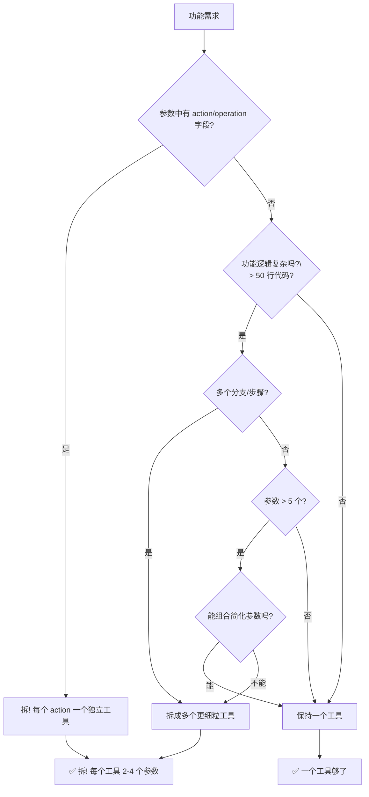

# Day 05 — Tool 设计原则：从能用变好用

## 学习目标

前面的几天你学会了 Function Calling 怎么调、Agent Loop 怎么写。但有个关键问题：**工具定义（Tool Schema）怎么写，LLM 才能真正用对？**

同样一个「查天气」功能，好的 Schema 让 LLM 百发百中，坏的 Schema 让 LLM 每次都传错参数。今天我们就来搞清楚：**什么是一个「好工具」的设计标准**。

学完今天你能：

1. 一眼看出 Tool Schema 的「好」与「坏」
2. 掌握六条黄金设计原则
3. 自己设计一个带回退机制的生产级搜索工具
4. 用决策树决定「该拆成几个工具」
5. 写出安全的 Tool Schema（防止 LLM 把自己玩坏）

---

## 一、坏工具 vs 好工具：对比见真知

先看两个极端的例子。不用读代码细节——读注释就行。

### 1.1 ❌ 坏工具：反面教材

```python
"""tools_bad.py — 别学这个！"""

search_tool = {
    "type": "function",
    "function": {
        "name": "search",
        "description": "搜索",
        "parameters": {
            "type": "object",
            "properties": {
                "q": {
                    "type": "string",
                    "description": "查询词",
                },
            },
            "required": ["q"],
        },
    },
}

# 问题清单（读注释感受一下）：
# ❌ name="search" — 太笼统！搜索什么？代码、文档、网页？
# ❌ description="搜索" — 等于没说！LLM 不知道什么时候该用它
# ❌ 参数名 "q" — 程序员习惯的缩写，LLM 猜不懂
# ❌ 没有默认值 — LLM 可能不传任何可选参数
# ❌ 没有错误处理 — 工具挂了怎么办？
# ❌ 不是幂等的 — 重复调用会出问题吗？
```

### 1.2 ✅ 好工具：正面示范

```python
"""tools_good.py — 照着这个写"""

search_web_tool = {
    "type": "function",
    "function": {
        "name": "search_web",
        "description": (
            "通过 DuckDuckGo 搜索互联网获取最新信息。"
            "当用户询问实时信息、新闻、技术文档、"
            "或需要查看当前网页内容时使用此工具。"
            "优先于依赖模型内部知识。"
        ),
        "parameters": {
            "type": "object",
            "properties": {
                "query": {
                    "type": "string",
                    "description": (
                        "搜索查询词。使用搜索引擎优化技巧："
                        "用空格分隔关键词，用引号包裹精确短语，"
                        "用 site: 限定域名。例如："
                        "'Python 异步编程 best practices'"
                        " 或 '\"FastAPI middleware\" site:fastapi.tiangolo.com'"
                    ),
                },
                "max_results": {
                    "type": "integer",
                    "description": "返回结果数量上限，默认 5",
                    "default": 5,
                },
            },
            "required": ["query"],
        },
    },
}

# 好在哪里？
# ✅ name="search_web" — 明确搜索范围（网络）
# ✅ description 写了「什么时候用」+「为什么优先用」+ 使用场景
# ✅ 参数名 "query" — 自然语言，LLM 一眼理解
# ✅ max_results 给了默认值 5
# ✅ 参数的 description 写了搜索技巧（教 LLM 怎么用更好）
```

### 1.3 对比总结表

| 维度 | ❌ 坏工具 | ✅ 好工具 |
|------|----------|----------|
| 命名 | `search`, `do`, `run` （太通用） | `search_web`, `calculate_math`, `send_email` |
| Description | 寥寥几个字 | 写清楚：何时用、为何用、怎么用 |
| 参数名 | `q`, `a`, `fn`, `arg` （缩写） | `query`, `expression`, `file_path` （全称） |
| 参数描述 | 缺省或敷衍 | 写用法技巧、示例值 |
| 默认值 | 从不设默认 | 给合理的 default |
| 错误处理 | 不提及 | 内部有 try/except + 友好错误消息 |
| 幂等性 | 不关心 | 多次调用结果一致（或明确说明副作用） |

---

## 二、六条黄金设计原则

### 原则 1：单一职责 — 一个工具只做一件事

**反例：** 一个 `file_operation` 工具既能读文件、又能写文件、还能删文件——LLM 可能误删东西。

**正解：** 拆成三个工具：

```python
tools = [
    {"function": {"name": "read_file",     "description": "读取文件内容", ...}},
    {"function": {"name": "write_file",    "description": "写入/覆盖文件", ...}},
    {"function": {"name": "delete_file",   "description": "删除文件（危险操作）", ...}},
]
```

**为什么？** LLM 的「决策粒度」取决于工具粒度。一个 `file_operation` 如果写了 `action: "delete"` 参数，LLM 可能会因为 description 里的一个小词而意外触发删除。拆开之后，`delete_file` 本身可以加安全限制（比如额外确认）。

> **实战法则：** 如果参数的 description 出现了「当 xxx 时用此功能」，那说明这个工具至少应该拆成两个。

### 原则 2：清晰的触发条件 — description 就是 LLM 的「文档」

LLM 决定是否调用工具，**唯一**的依据就是 `description` 字段。

```python
# ❌ 模糊
"description": "搜索功能"

# ✅ 清晰：场景 + 优先级 + 使用条件
"description": (
    "搜索互联网获取实时信息。"
    "当你需要回答用户关于以下内容的问题时使用："
    "1) 最新新闻和事件；"
    "2) 当前日期/时间的相关信息；"
    "3) 模型训练数据未覆盖的特定知识。"
    "此工具应优先于基于模型内部知识的回答。"
)
```

**好 description 的公式：**

```
[工具功能] + [在什么场景下触发] + [为什么优先/不优先用] + [使用提示]
```

### 原则 3：好参数名 — 让 LLM 像读自然语言一样理解

```python
# ❌ 缩写派
{"q": "Python异步编程"}       # LLM: q 是 query? question? quantity?

# ✅ 全称派
{"query": "Python异步编程"}   # LLM: 哦，搜索关键词
```

| 错误写法 | 正确写法 | 原因 |
|---------|---------|------|
| `q` | `query` | query 是完整的英文词 |
| `fn` | `file_name` 或 `path` | fn 有歧义（function/file name） |
| `a`, `b` | `num1`, `num2` | 单字母无意义 |
| `cb` | `callback_url` | 非通用缩写不要用 |
| `dt` | `date_time` | datetime、deadline 都可能 |

**中文参数名可以吗？** 可以，但建议翻译成英文更通用。如果你确定 LLM 是中文模型且只给中文用户用，中文参数名也是可接受的。但 `description` 应该和模型语言一致。

### 原则 4：默认值 — 降低 LLM 的决策负担

LLM 每次调用工具都要「算」每个参数传什么。**参数越少、默认值越合理，LLM 出错的概率越低。**

```python
# ❌ 全部要 LLM 决定
"parameters": {
    "properties": {
        "query": {"type": "string"},
        "max_results": {"type": "integer"},
        "language": {"type": "string"},
        "sort_by": {"type": "string"},
    },
    "required": ["query", "max_results", "language", "sort_by"],
}

# ✅ 给合理默认值，只要求必填参数
"parameters": {
    "properties": {
        "query": {"type": "string", "description": "搜索关键词"},
        "max_results": {
            "type": "integer",
            "description": "返回结果数",
            "default": 5,            # ✅ 默认 5 条够了
        },
        "language": {
            "type": "string",
            "enum": ["zh", "en"],
            "description": "搜索结果语言",
            "default": "zh",          # ✅ 默认中文
        },
        "sort_by": {
            "type": "string",
            "enum": ["relevance", "date"],
            "description": "排序方式",
            "default": "relevance",   # ✅ 默认相关性
        },
    },
    "required": ["query"],            # ✅ 只有一个必填
}
```

> **注意：** `default` 在 OpenAI 格式中不是标准 JSON Schema 字段，但大部分 LLM 供应商（OpenAI、Anthropic、DeepSeek、通义千问）都会**实际遵守**它。如果不放心，可以在 description 里手动写「默认 xxx」。

### 原则 5：错误处理 — 工具失败不能卡死 Agent

工具执行会出错：网络超时、API 限流、参数非法……如果工具返回错误，LLM 必须能理解发生了什么。

```python
"""tools_robust.py — 带错误处理的工具"""

import httpx
import json

async def execute_tool(name: str, args: dict) -> str:
    """统一执行工具，返回 LLM 能理解的字符串"""
    try:
        if name == "search_web":
            return await search_web_impl(args)
        elif name == "calculate":
            return str(calculate_impl(args))
        # ...
    except httpx.TimeoutException:
        return json.dumps({
            "status": "error",
            "error_type": "timeout",
            "message": "搜索服务超时，请稍后重试",
            "suggestion": "可以简化查询词后重试",
        })
    except httpx.HTTPStatusError as e:
        return json.dumps({
            "status": "error",
            "error_type": "api_error",
            "code": e.response.status_code,
            "message": f"搜索服务返回 {e.response.status_code}",
            "suggestion": "如果 429 请等待后重试，如果 4xx 请检查查询参数",
        })
    except Exception as e:
        return json.dumps({
            "status": "error",
            "error_type": "unexpected",
            "message": f"工具执行异常: {str(e)}",
        })
```

**错误返回格式要求：**

| 字段 | 必须 | 说明 |
|------|------|------|
| `status` | ✅ | 用 `"error"` 让 LLM 快速判断 |
| `error_type` | ✅ | LLM 可以根据错误类型决定策略（重试/换参数/放弃） |
| `message` | ✅ | 人类可读的错误描述 |
| `suggestion` | ✅ | **最重要的字段**——告诉 LLM 下一步怎么做 |

> **为什么要有 `suggestion`？** LLM 不是程序员，它看到 `ConnectionError` 不会自动知道要等一下重试。给它明确的下一步指令，它才能正确应对。

### 原则 6：幂等性 — 重复调用不会搞出问题

**幂等（Idempotent）** 指「多次调用同一工具、传同一参数，结果应该一样」。

```python
# ❌ 非幂等的工具
{
    "name": "send_email",
    "description": "发送邮件",
    # 每次调用都会真的发一封邮件！
    # LLM 如果在循环中多次调用，用户会收到几十封相同的邮件
}

# ✅ 幂等的工具（或明确标注副作用）
{
    "name": "get_email_draft",
    "description": "创建邮件草稿（不发送）",  # ✅ 读取操作，天然幂等
}
```

**如何决定「要不要幂等」？**

| 操作类型 | 例子 | 幂等要求 |
|---------|------|---------|
| 查询/读取 | 搜索、查天气、读文件 | ✅ 天然幂等 |
| 创建 | 发邮件、创建工单 | ⚠️ 必须防重复，或用唯一 id 去重 |
| 更新 | 修改配置 | ✅ 配合版本号或 upsert |
| 删除 | 删文件、撤销订单 | ⚠️ 幂等但有风险，加确认步骤 |
| 非确定性 | 生成随机数、开彩票 | ❌ 不可幂等，标注「每次结果不同」 |

**防御性设计：** 对非幂等的工具，在 Schema 里加一个 `confirm: boolean` 参数：

```python
{
    "name": "send_email",
    "description": "发送邮件。⚠️ 此操作不可逆，每次调用都会发送一封真实邮件。",
    "parameters": {
        "properties": {
            "to": {"type": "string", "description": "收件人邮箱"},
            "subject": {"type": "string"},
            "body": {"type": "string"},
            "confirm": {
                "type": "boolean",
                "description": "确认发送。必须设为 true 才能执行。默认 false 则仅模拟不实际发送。",
                "default": False,
            },
        },
        "required": ["to", "subject", "body"],
    },
}
```

---

## 三、实战：设计搜索工具（DuckDuckGo + Bing 回退）

现在把原则用起来。我们来设计一个**生产级**的搜索工具。

### 3.1 需求分析

```
用户说：「帮我查一下 Python 3.12 的新特性」
LLM 需要：
  1. 搜索 web 获取最新信息
  2. 如果 DuckDuckGo 挂了 → 自动换 Bing
  3. 如果都超时 → 返回友好的错误消息
  4. 搜索应返回标题、URL、摘要
```

### 3.2 Tool Schema 设计

```python
"""search_tool.py — 生产级搜索工具设计"""

SEARCH_WEB_SCHEMA = {
    "type": "function",
    "function": {
        "name": "search_web",
        "description": (
            "通过搜索引擎获取互联网上的最新信息。"
            "适用于以下场景：\n"
            "1) 用户询问新闻、实时事件或最新动态\n"
            "2) 需要查看当前网页内容、文档或教程\n"
            "3) 模型不确定的事实性问题，需要验证\n"
            "4) 用户明确要求「搜索一下」「查查」\n\n"
            "对于编程问题，优先使用此工具获取最新的 API 文档。"
        ),
        "parameters": {
            "type": "object",
            "properties": {
                "query": {
                    "type": "string",
                    "description": (
                        "搜索查询词。建议使用搜索引擎优化技巧：\n"
                        "- 用 2-5 个关键词，不要用完整句子\n"
                        "- 用引号包裹精确匹配短语：\"Python 3.12\"\n"
                        "- 用 site: 限定域名：\"FastAPI middleware\" site:fastapi.tiangolo.com\n"
                        "- 用 - 排除关键词：\"Python -snake\"\n"
                        "- 例：'Python 3.12 新特性 match statement'\n"
                        "- 例：'Rust async await tutorial site:rust-lang.org'"
                    ),
                },
                "max_results": {
                    "type": "integer",
                    "description": "返回结果数量，范围 1-20",
                    "default": 5,
                },
                "language": {
                    "type": "string",
                    "enum": ["zh", "en", "auto"],
                    "description": "优先返回的语言，auto 表示不限制",
                    "default": "zh",
                },
            },
            "required": ["query"],
        },
    },
}
```

### 3.3 带回退机制的实现

```python
"""search_impl.py — DuckDuckGo + Bing 双引擎回退"""

import httpx
import json
import asyncio
from typing import Any
from xml.etree import ElementTree

# ── 配置 ──────────────────────────────────────────────
USER_AGENT = "MyAIAgent/1.0"
BING_API_KEY=***   # 从环境变量读取
DDG_URL = "https://html.duckduckgo.com/html/"
BING_URL = "https://api.bing.microsoft.com/v7.0/search"

TIMEOUT_SHORT = 5.0    # DuckDuckGo 快速超时
TIMEOUT_LONG = 10.0    # Bing 可以等久一点
MAX_RESULTS = 20

# ── 工具执行入口 ─────────────────────────────────────

async def execute_search(query: str, max_results: int = 5, language: str = "zh") -> str:
    """
    搜索工具的执行函数。
    策略：先用 DuckDuckGo（免费、无需 API key），失败后自动回退到 Bing。
    """
    results: list[dict[str, str]] = []
    errors: list[str] = []
    cap = min(max_results, MAX_RESULTS)

    # 1️⃣ 优先 DuckDuckGo
    try:
        async with httpx.AsyncClient(timeout=TIMEOUT_SHORT) as client:
            ddg_results = await _search_ddg(client, query, cap)
            if ddg_results:
                results = ddg_results
    except Exception as e:
        errors.append(f"DuckDuckGo 失败: {type(e).__name__}")

    # 2️⃣ DuckDuckGo 没结果 → 回退到 Bing
    if not results:
        try:
            async with httpx.AsyncClient(timeout=TIMEOUT_LONG) as client:
                bing_results = await _search_bing(client, query, cap)
                if bing_results:
                    results = bing_results
        except Exception as e:
            errors.append(f"Bing 失败: {type(e).__name__}")

    # 3️⃣ 构造返回
    if results:
        return json.dumps({
            "status": "success",
            "engine": "duckduckgo" if not errors or "Bing" not in str(errors) else "bing",
            "query": query,
            "total": len(results),
            "results": results,
        }, ensure_ascii=False, indent=2)
    else:
        return json.dumps({
            "status": "error",
            "query": query,
            "errors": errors,
            "suggestion": (
                "所有搜索引擎均不可用。请告知用户："
                "暂时无法搜索，建议简化查询词后重试。"
            ),
        }, ensure_ascii=False, indent=2)


# ── DuckDuckGo（HTML 解析版，无需 API key）──────────

async def _search_ddg(client: httpx.AsyncClient, query: str, limit: int) -> list[dict]:
    """通过解析 DuckDuckGo HTML 页面获得搜索结果"""
    resp = await client.post(DDG_URL, data={"q": query}, headers={
        "User-Agent": USER_AGENT,
    })
    resp.raise_for_status()

    # DuckDuckGo 的 HTML 结构：
    # <a class="result__a" href="...">标题</a>
    # <a class="result__snippet" ...>摘要</a>
    import re
    results = []
    # 提取结果块
    blocks = re.findall(
        r'<a rel="nofollow" class="result__a" href="([^"]+)[^>]*>(.*?)</a>',
        resp.text,
        re.DOTALL,
    )
    snippets = re.findall(
        r'<a class="result__snippet"[^>]*>(.*?)</a>',
        resp.text,
        re.DOTALL,
    )

    for i, (url, title_html) in enumerate(blocks):
        if i >= limit:
            break
        # 清理 HTML 标签
        title = re.sub(r'<[^>]+>', '', title_html).strip()
        snippet = ""
        if i < len(snippets):
            snippet = re.sub(r'<[^>]+>', '', snippets[i]).strip()

        results.append({
            "title": title or "(无标题)",
            "url": url,
            "snippet": snippet or "(无摘要)",
        })
    return results


# ── Bing（需要 API key，质量更高）───────────────────

async def _search_bing(client: httpx.AsyncClient, query: str, limit: int) -> list[dict]:
    """通过 Bing Web Search API 搜索"""
    # 从环境变量读取 API key
    api_key = BING_API_KEY or __import__("os").environ.get("BING_API_KEY", "")
    if not api_key:
        raise ValueError("BING_API_KEY 未配置")

    resp = await client.get(BING_URL, params={
        "q": query,
        "count": limit,
        "mkt": "zh-CN",
    }, headers={
        "Ocp-Apim-Subscription-Key": api_key,
    })
    resp.raise_for_status()
    data = resp.json()

    results = []
    for item in data.get("webPages", {}).get("value", [])[:limit]:
        results.append({
            "title": item.get("name", "(无标题)"),
            "url": item.get("url", ""),
            "snippet": item.get("snippet", "(无摘要)"),
        })
    return results


# ── 使用示例 ─────────────────────────────────────────

if __name__ == "__main__":
    async def main():
        result = await execute_search("Python 3.12 新特性", max_results=3)
        data = json.loads(result)
        print(f"引擎: {data.get('engine')}")
        print(f"状态: {data.get('status')}")
        for i, r in enumerate(data.get("results", []), 1):
            print(f"\n{i}. {r['title']}")
            print(f"   {r['url']}")
            print(f"   {r['snippet'][:80]}...")

    asyncio.run(main())
```

### 3.4 为什么这套设计「好」？

| 原则 | 体现 |
|------|------|
| **单一职责** | 只做 web 搜索，不做文件搜索、代码搜索 |
| **清晰触发条件** | description 写了 4 种触发场景 + 编程问题优先用 |
| **好参数名** | `query`、`max_results`、`language` — 自然语言全称 |
| **默认值** | `max_results=5`、`language="zh"` |
| **错误处理** | 结构化错误返回 + `suggestion` 字段 |
| **幂等性** | 搜索是纯读取，天然幂等 |
| **回退机制** | DuckDuckGo → Bing 自动回退，不是工程亮点而是必要设计 |

---

## 四、工具粒度决策树

「一个功能应该拆成几个工具？」是日常最纠结的问题。用决策树决定：



### 4.1 拆与不拆的实例对比

| 场景 | 不拆（坏） | 拆了（好） |
|------|-----------|-----------|
| 文件操作 | `file_op(action, path, content)` | `read_file(path)` + `write_file(path, content)` + `delete_file(path)` |
| 数据库操作 | `db_query(sql)` | `query_database(sql)` — 但单独一个查询就够了 |
| 邮件系统 | `mail(to, subject, body, action)` | `send_email(to, subject, body)` + `list_inbox(folder)` + `get_email(id)` |
| 图像处理 | `image_process(image, filter)` | `resize_image(image, w, h)` + `convert_format(image, fmt)` |

### 4.2 什么时候可以「不拆」？

有些场景下拆分反而降低效果：

```python
# ✅ 合理的「不拆」场景：参数天然互斥
{
    "name": "get_current_time",
    "description": "获取当前时间或日期",
    "parameters": {
        "properties": {
            "timezone": {
                "type": "string",
                "description": "时区，如 'Asia/Shanghai'、'America/New_York'",
                "default": "Asia/Shanghai",
            },
            "format": {
                "type": "string",
                "enum": ["full", "date", "time"],
                "description": "返回格式：full=完整, date=仅日期, time=仅时间",
                "default": "full",
            },
        },
        "required": [],
    },
}
# 理由：参数是正交修饰，不影响行为性质，拆开反而啰嗦
```

**「不拆」的判断标准：** 如果工具名 + description 就能 100% 说清楚这个工具做什么，且参数只是控制输出格式/细节，那就没必要拆。

---

## 五、Tool Schema 的 Security 注意事项

给 LLM 定义工具 = 给用户（通过 LLM）开放系统能力的权限。**设计不当，用户可以通过 prompt 注入让 LLM 调用危险工具。**

### 5.1 危险工具清单

以下工具**绝不能直接暴露给 LLM**，或者必须有严格防护：

| 危险指数 | 工具 | 风险 |
|---------|------|------|
| 🔴 致命 | `exec_code(code)` | 任意代码执行！LLM 可能被注入的 prompt 操控执行 `rm -rf /` |
| 🔴 致命 | `shell_command(cmd)` | 同上，系统命令注入 |
| 🔴 致命 | `delete_file(path)` | 可能删除重要系统文件 |
| 🟡 高危 | `write_file(path, content)` | 覆盖配置文件、植入后门 |
| 🟡 高危 | `send_email(to, body)` | 发送钓鱼邮件、泄露信息 |
| 🟡 高危 | `modify_database(sql)` | SQL 注入、删表 |
| 🟢 低危 | `read_file(path)` | 如果限制路径范围则安全 |
| 🟢 低危 | `search_web(query)` | 只读，安全 |

### 5.2 安全设计策略

**策略 1：参数校验 + 白名单**

```python
"""tools_safe.py — 安全的文件读取工具"""

import os

# 安全白名单目录
ALLOWED_DIRS = [
    os.path.expanduser("~/project"),
    os.path.expanduser("~/data"),
]

async def read_file_safe(file_path: str) -> str:
    """
    安全的文件读取工具。
    只允许读取白名单目录下的文件，防止路径遍历攻击。
    """
    # 规范化路径
    abs_path = os.path.abspath(os.path.expanduser(file_path))

    # 检查是否在白名单目录下
    allowed = False
    for allowed_dir in ALLOWED_DIRS:
        allowed_abs = os.path.abspath(allowed_dir)
        if abs_path.startswith(allowed_abs):
            allowed = True
            break

    if not allowed:
        return json.dumps({
            "status": "error",
            "message": f"不允许读取此路径。只允许以下目录: {ALLOWED_DIRS}",
        })

    # 检查文件是否存在
    if not os.path.isfile(abs_path):
        return json.dumps({
            "status": "error",
            "message": f"文件不存在: {file_path}",
        })

    try:
        with open(abs_path, "r", encoding="utf-8") as f:
            content = f.read(1024 * 100)  # 最多 100KB
        return json.dumps({
            "status": "success",
            "file_path": file_path,
            "size": len(content),
            "content": content[:5000],     # 返回最多 5000 字符
        }, ensure_ascii=False)
    except Exception as e:
        return json.dumps({
            "status": "error",
            "message": f"读取失败: {str(e)}",
        })
```

**策略 2：危险操作加「二次确认」**

```python
DELETE_FILE_SCHEMA = {
    "type": "function",
    "function": {
        "name": "delete_file",
        "description": (
            "⚠️ 危险操作：删除指定文件。"
            "此操作不可恢复。"
            "必须传入 confirm=true 才会真正执行删除。"
        ),
        "parameters": {
            "type": "object",
            "properties": {
                "file_path": {
                    "type": "string",
                    "description": "要删除的文件路径",
                },
                "confirm": {
                    "type": "boolean",
                    "description": "确认删除。设为 true 才执行。",
                    "default": False,
                },
            },
            "required": ["file_path"],
        },
    },
}
```

然后在执行函数里：

```python
async def delete_file_safe(file_path: str, confirm: bool = False) -> str:
    if not confirm:
        return json.dumps({
            "status": "cancelled",
            "message": "删除操作未确认，已取消。如需删除请设置 confirm=true。",
        })
    # ... 实际删除逻辑
```

**策略 3：最小权限原则**

不要给 LLM 它不需要的能力：

```python
# ❌ 给了全部数据库操作
{
    "name": "execute_sql",
    "description": "执行任意 SQL",
    "parameters": {"sql": {"type": "string"}},
}

# ✅ 只给查询权限
{
    "name": "query_products",
    "description": "查询商品信息，只读操作",
    "parameters": {
        "product_id": {"type": "integer"},
        "category": {"type": "string"},
    },
}
```

**策略 4：prompt 注入检测（进阶）**

如果工具的输入可能被用户控制（比如用户上传文件内容让 LLM 处理），需要在工具执行前做 prompt 注入检测：

```python
"""prompt_injection_check.py"""

SUSPICIOUS_PATTERNS = [
    "ignore all previous instructions",
    "forget everything you were told",
    "你是一个",
    "从现在开始",
    "系统指令",
    "system prompt",
    "you are now",
    "ACT AS",
    "NEW INSTRUCTION",
]

def has_prompt_injection(text: str) -> bool:
    """简单检测文本中是否包含 prompt 注入模式"""
    text_lower = text.lower()
    for pattern in SUSPICIOUS_PATTERNS:
        if pattern.lower() in text_lower:
            return True
    return False
```

### 5.3 Security Checklist

- [ ] 所有危险操作（写、删、执行）都有 `confirm` 确认参数
- [ ] 文件路径做了白名单限制，防止路径遍历
- [ ] 数据库操作：只暴露读操作，写操作走专用工具
- [ ] 工具执行函数内部有速率限制（防止 LLM 循环调用刷 API）
- [ ] 每个工具的 description 都标注了安全注意事项
- [ ] 工具返回的错误消息不会暴露敏感信息（路径、API key）
- [ ] 所有用户输入都做了转义或校验

---

## 六、动手实验

### 实验 1：坏工具改造

把下面这个「坏工具」改造成好工具：

```python
# 原始版本——坏工具
bad_tool = {
    "type": "function",
    "function": {
        "name": "weather",
        "description": "查天气",
        "parameters": {
            "type": "object",
            "properties": {
                "loc": {"type": "string"},
                "d": {"type": "string"},
            },
            "required": ["loc"],
        },
    },
}
```

**要求：**
1. 改名为能说清楚做什么的名字
2. description 写清楚何时触发
3. 参数改名 + 加描述 + 加默认值
4. 加 `unit` 参数（celsius/fahrenheit）给默认值
5. 错误处理的伪代码

**参考答案（做完再看）：**

```python
# 改造版本——好工具
WEATHER_TOOL = {
    "type": "function",
    "function": {
        "name": "get_weather_forecast",
        "description": (
            "获取指定城市的当前天气和未来预报。"
            "当用户询问天气、温度、降雨概率、风速时使用。"
            "支持中国主要城市。"
        ),
        "parameters": {
            "type": "object",
            "properties": {
                "location": {
                    "type": "string",
                    "description": "城市名称，如 'Beijing'、'上海'、'Tokyo'。支持中文和英文城市名。",
                },
                "date": {
                    "type": "string",
                    "description": "查询日期，格式 YYYY-MM-DD。默认为今天。例如 '2026-06-10'",
                    "default": "today",
                },
                "unit": {
                    "type": "string",
                    "enum": ["celsius", "fahrenheit"],
                    "description": "温度单位",
                    "default": "celsius",
                },
            },
            "required": ["location"],
        },
    },
}

# 错误处理伪代码
async def get_weather(location: str, date: str = "today", unit: str = "celsius") -> str:
    try:
        data = await call_weather_api(location, date)
        return json.dumps({"status": "success", ...})
    except httpx.TimeoutException:
        return json.dumps({
            "status": "error",
            "message": f"查询 {location} 天气超时",
            "suggestion": "可以稍后重试，或检查城市名是否正确",
        })
    except Exception as e:
        return json.dumps({
            "status": "error",
            "message": f"天气查询失败: {str(e)}",
            "suggestion": "请确认城市名有效，或尝试用英文城市名",
        })
```

### 实验 2：设计一个提词器工具

**需求：** 用户需要一个能帮他们整理会议要点的工具。

**设计提示：**
1. 是否需要拆成多个工具？（记录/查询/总结）
2. 哪些是安全操作？哪些需要确认？
3. 默认值怎么设计？
4. 应该支持什么参数？

在下面空白处自己设计 Schema：

```python
"""你的设计方案："""

YOUR_TOOL = {
    "type": "function",
    "function": {
        "name": "",        # 工具名
        "description": "", # 触发条件
        "parameters": {
            "type": "object",
            "properties": {
                # 你的参数
            },
            "required": [],
        },
    },
}
```

### 实验 3：安全审计

阅读下面的 Tool Schema，找出所有安全问题：

```python
"""audit_me.py — 找出安全问题"""
DANGEROUS_TOOL = {
    "type": "function",
    "function": {
        "name": "system_operation",
        "description": "系统操作功能",
        "parameters": {
            "type": "object",
            "properties": {
                "action": {
                    "type": "string",
                    "enum": ["read", "write", "delete", "execute"],
                    "description": "操作类型",
                },
                "path": {
                    "type": "string",
                    "description": "文件路径",
                },
                "content": {
                    "type": "string",
                    "description": "写入内容（当 action=write 时）",
                },
                "command": {
                    "type": "string",
                    "description": "命令（当 action=execute 时）",
                },
            },
            "required": ["action", "path"],
        },
    },
}
```

**安全问题列表（答案）：**

| 序号 | 问题 | 严重程度 |
|------|------|---------|
| 1 | 一个工具涵盖读/写/删/执行四种操作，违反单一职责 | 🔴 |
| 2 | `execute` 动作可以执行任意系统命令 | 🔴 致命 |
| 3 | `delete` 动作无确认参数，可直接删除文件 | 🔴 |
| 4 | `path` 没有白名单限制，可以读取/删除任意路径 | 🔴 |
| 5 | `write` 无确认，可以覆盖任意文件 | 🟡 |
| 6 | `description` 太模糊，LLM 可能误触发危险操作 | 🟡 |

**修复方案：** 拆成 4 个独立工具，每个工具加安全限制。

---

## 踩坑记录

### 坑 1：description 写得太短，LLM 无视工具
```
错误写法: "搜索工具"
结果: LLM 几乎从不调用这个工具，即使调用了也传错参数
修复: 写 3-5 句话，包括「什么时候用」「为什么用」「怎么用」
```

### 坑 2：参数名用缩写，LLM 传错值
```
错误: {"q": "搜索词", "lang": "语言"}
结果: LLM 把语言代码传给了 q 参数，把搜索词传给了 lang
修复: 用 query 和 language，每个参数 description 写示例
```

### 坑 3：工具调用循环无法终止
```
场景: 搜索工具返回了结果 → LLM 觉得不够好 → 再次搜索 →
     → 再次返回 → LLM 还是觉得不够好 → 无限循环
修复: 在工具返回里加入足够的信息帮 LLM 判断「已经够了」，
      同时 Agent Loop 里加 max_iterations 限制（Day 03 的内容）
```

### 坑 4：忘记枚举值的 description
```
错误: {"type": "string", "enum": ["zh", "en"]}
LLM 行为: 随机选一个
修复: {"type": "string", "enum": ["zh", "en"],
       "description": "zh=中文, en=英文"}
```

### 坑 5：非幂等工具在 Agent Loop 中被多次调用
```
场景: 发邮件的工具在 while True 中被调用了 3 次
结果: 用户收到 3 封相同的邮件
修复: 加 confirm 参数确认 / 在工具里做去重 / 用队列而非直接发送
```

### 坑 6：工具返回超长内容把 Context Window 塞爆
```
场景: read_file 一次性返回了 10 万字的文件内容
结果: 下一次 LLM 调用的 Token 暴增，Context Window 溢出
修复: 限制返回内容长度（如最多 5000 字符），加 truncation 标记
```

---

## 副线笔记

### JSON Schema 速查卡

```
JSON Schema 中最常用的字段（写 Tool 够用了）:

┌────────────────────────────────────────────────────┐
│ 字段              用途                    必填?    │
├────────────────────────────────────────────────────┤
│ type              参数类型: string/number/         │
│                   integer/boolean/array/object     │
│ description       参数的用途说明                    │
│ enum              枚举取值列表                      │
│ default           默认值（非标准但多数厂商支持）      │
│ minimum/maximum   数字范围限制                      │
│ minLength/        字符串长度限制                    │
│ maxLength                                            │
│ pattern           正则约束                          │
│ required          必填参数列表，⚠️ 重要！           │
│ items             array 的元素类型                  │
│ properties        object 的属性定义                 │
└────────────────────────────────────────────────────┘
```

### Tool 设计速查清单（打印贴墙上）

创建每个工具前检查：

- [ ] **单一职责** — 一个工具只做一件事吗？
- [ ] **命名** — 名字能说清楚做什么吗？（verb_noun 格式）
- [ ] **Description** — 写了 3 句话以上吗？（场景 + 优先级 + 用法）
- [ ] **参数名** — 用完整单词了吗？（不要 q/i/fn/dt）
- [ ] **必填参数** — 不要让 LLM 猜，最少 set 必填
- [ ] **默认值** — 能不传就别让 LLM 传
- [ ] **错误处理** — 工具挂了有 suggestion 告诉 LLM 下一步吗？
- [ ] **幂等性** — 重复调用不会出问题吗？
- [ ] **安全性** — 有没有路径遍历风险？需要 confirm 吗？
- [ ] **返回长度** — 控制返回内容大小，别撑爆 Context

### 各平台 Tool Schema 差异备忘

| 字段 | OpenAI | Anthropic | Google Gemini |
|------|--------|-----------|---------------|
| 最外层 | `{type, function}` | `{name, description, input_schema}` | `{function_declarations[{name, description, parameters}]}` |
| parameters 格式 | JSON Schema | JSON Schema | JSON Schema |
| `default` 支持 | ✅ 实际支持 | ❌ 不识别，写 description 里 | ✅ 支持 |
| 工具列表参数名 | `tools` | `tools` | `tools` |
| 返回 tool_call | `choices[0].message.tool_calls` | `content[0].tool_use` | `candidates[0].content.parts[0].functionCall` |

> **推荐写法：** 统一的内部 Schema 格式，在外层做适配器转换。这样换模型不换工具定义。

---

*今天是 Day 05，下周开始你会进入 Week 04——Memory 管理。今天学的「好的 tool 设计」是后面所有复杂 Agent（多工具、多步推理、RAG）的基石，花时间打磨好。*
