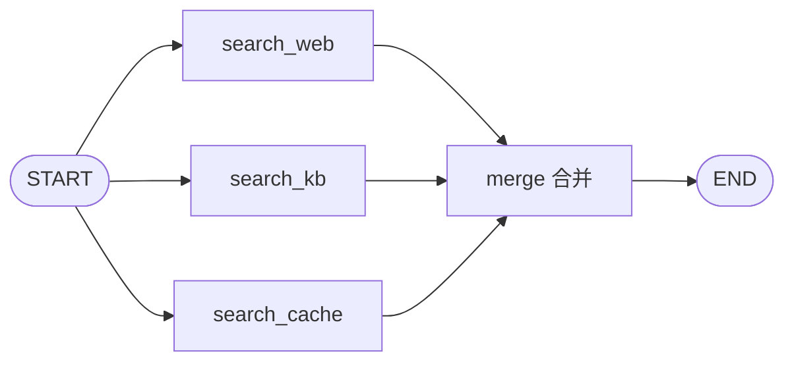
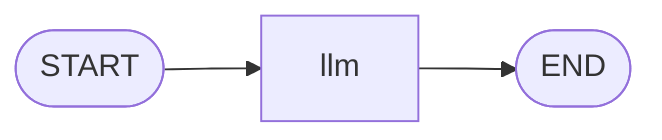

# Day 06 — 高级模式 + Claude Code 调试状态机

## 学习目标

Day 03-05 我们把 Agent 从 Week 03 的 `while True` 手写循环，升级成了 LangGraph 的"节点 + 边"显式图，并加上了 Checkpointer 持久化和 `interrupt()` 人机交互。到此单个 Agent 已经能跑了，但真实业务里图的规模会膨胀：检索要查多个数据源、回复要逐 token 流给前端、子流程要能复用。今天讲 LangGraph 的三件高级武器——**子图（Subgraph）、并行节点（Parallel）、流式输出（stream）**，把图从"能跑"推向"能上生产"。副线迎来本周高潮：用 Claude Code 可视化 Graph 结构、定位卡死的节点，把"可观测性"真正用起来。

学完今天你能：
1. 把一个复杂图拆成多个子图，让子图作为节点嵌入主图，实现 State 隔离与流程复用
2. 用 `add_edge(START, "a")` + `add_edge(START, "b")` 做 fan-out/fan-in 并行，并用 `asyncio` 并发检索多个数据源
3. 区分 `stream_mode` 四种模式（values / updates / messages / debug），写出 `astream` 逐 token 流式，呼应 Week 02 的 SSE
4. 用"调试三件套"（`get_state` / `draw_mermaid` / LangSmith trace）配合 Claude Code 定位 Agent 卡死、状态丢失等典型 bug

---

## 一、子图 Subgraph：把复杂图拆开

### 1.1 为什么需要子图

随着业务变复杂，一张图里可能塞了十几个节点：检索、重排、起草、校对、翻译……全堆在一张图里，既难维护也难复用。子图的思路很朴素：**把一段相对独立的子流程，单独编译成一张图，再作为一个节点嵌入主图。**

```
主图（主编排）              子图（研究子流程）
┌────────────────────┐     ┌──────────────────────┐
│  START → research  │ ──► │ planner → searcher   │
│        → draft     │     │        → summarizer  │
│        → END       │     └──────────────────────┘
└────────────────────┘           ↑ 作为节点整体嵌入
```

子图有两个关键特性：

| 特性 | 说明 | 价值 |
|------|------|------|
| 独立 State | 子图有自己的状态结构，主图和子图状态互不污染 | 团队协作时各管各的字段 |
| 可复用 | 同一个编译好的子图，能在多个主图里 `add_node` 嵌入 | 研究子流程给报告 Agent、客服 Agent 共用 |
| 可单独调试 | 子图本身是一张完整的图，能单独 `invoke` / `stream` | 不用跑通主图就能验证子流程 |

### 1.2 子图作为节点嵌入主图

LangGraph 的 API 很直接：**一个编译好的图（`CompiledGraph`）本身就可以作为节点传给 `add_node`**。

```python
"""subgraph_demo.py — 子图：研究子图嵌入主编排图"""

from typing import TypedDict, Annotated
from langgraph.graph import StateGraph, START, END
from langgraph.graph.message import add_messages


# ─── 1. 子图：研究子流程，独立 State ───
class ResearchState(TypedDict):
    """研究子图的内部状态，主图看不到这些字段。"""
    topic: str                 # 待研究主题
    findings: Annotated[list,  # 检索到的资料（列表拼接 reducer）
                        __import__("operator").add]


def planner_node(state: ResearchState) -> dict:
    """规划节点：把主题拆成检索词。"""
    keywords = [w for w in state["topic"].split() if w]
    return {"findings": [f"检索词: {k}" for k in keywords]}


def searcher_node(state: ResearchState) -> dict:
    """检索节点：模拟去知识库检索。"""
    return {"findings": [f"关于「{state['topic']}」的检索结果片段"]}


def summarizer_node(state: ResearchState) -> dict:
    """总结节点：把检索结果汇总成研究摘要。"""
    summary = "；".join(state["findings"])
    return {"findings": [f"研究摘要: {summary}"]}


# 子图编译：planner → searcher → summarizer
research_builder = StateGraph(ResearchState)
research_builder.add_node("planner", planner_node)
research_builder.add_node("searcher", searcher_node)
research_builder.add_node("summarizer", summarizer_node)
research_builder.add_edge(START, "planner")
research_builder.add_edge("planner", "searcher")
research_builder.add_edge("searcher", "summarizer")
research_builder.add_edge("summarizer", END)
research_app = research_builder.compile()   # 编译好的子图


# ─── 2. 主图：主编排，把子图当节点嵌入 ───
class MainState(TypedDict):
    """主图状态：只关心 topic 和 final_report。"""
    topic: str
    final_report: str


def route_node(state: MainState) -> dict:
    """主图入口节点：初始化主题。"""
    return {}   # 占位，topic 由调用方传入


def draft_node(state: MainState) -> dict:
    """起草节点：基于子图产出的研究摘要起草报告。"""
    return {"final_report": f"基于「{state['topic']}」起草的最终报告"}


# 关键：把编译好的子图 research_app 作为一个节点加入主图
main_builder = StateGraph(MainState)
main_builder.add_node("route", route_node)
main_builder.add_node("research", research_app)   # ← 子图作为节点
main_builder.add_node("draft", draft_node)
main_builder.add_edge(START, "route")
main_builder.add_edge("route", "research")
main_builder.add_edge("research", "draft")
main_builder.add_edge("draft", END)

main_app = main_builder.compile()

# 调用：主图 invoke，子图在内部自动跑完整套流程
result = main_app.invoke({"topic": "LangGraph 子图机制"})
print(result["final_report"])
```

> **关键点：** 主图的 `MainState` 里没有 `findings` 字段，子图的 `ResearchState` 里没有 `final_report` 字段——两者 State 隔离。子图跑完后，主图只能拿到子图"对外暴露"的那部分（通过 State 字段名对齐传递）。这让团队协作时"研究组"和"报告组"各管各的状态，互不干扰。

---

## 二、并行节点：fan-out / fan-in

### 2.1 同一源连多个目标就是并行

LangGraph 里实现并行非常简单：**从同一个源节点连多条边到不同目标，这些目标就会并行执行**，全部完成后才会汇合到下一个节点。

```python
from langgraph.graph import StateGraph, START, END

# fan-out：START 同时连到 search_web / search_kb / search_cache
graph.add_edge(START, "search_web")     # ┐
graph.add_edge(START, "search_kb")      # ├─ 三路并行
graph.add_edge(START, "search_cache")   # ┘

# fan-in：三路都汇合到 merge 节点
graph.add_edge("search_web", "merge")
graph.add_edge("search_kb", "merge")
graph.add_edge("search_cache", "merge")
graph.add_edge("merge", END)
```

对应的图结构：



### 2.2 并行检索多个数据源

真实场景：一个查询要同时查 Web、知识库、缓存，谁先回来谁先填，全部到齐再合并。这正是 Week 04/05 向量库检索的"多路召回"升级版——从串行变成并行。

```python
"""parallel_search.py — 并行检索多数据源（fan-out / fan-in）"""

import asyncio
from typing import TypedDict, Annotated
import operator
from langgraph.graph import StateGraph, START, END


class SearchState(TypedDict):
    query: str
    # results 用 operator.add reducer：多路并行结果自动拼接成一个列表
    results: Annotated[list[str], operator.add]


async def search_web(state: SearchState) -> dict:
    """模拟异步查 Web（耗时 0.3s）。"""
    await asyncio.sleep(0.3)
    return {"results": [f"[Web] {state['query']} 的网页结果"]}


async def search_kb(state: SearchState) -> dict:
    """模拟异步查知识库（耗时 0.2s）。"""
    await asyncio.sleep(0.2)
    return {"results": [f"[KB] {state['query']} 的知识库结果"]}


async def search_cache(state: SearchState) -> dict:
    """模拟异步查缓存（耗时 0.1s）。"""
    await asyncio.sleep(0.1)
    return {"results": [f"[Cache] {state['query']} 的缓存结果"]}


async def merge_node(state: SearchState) -> dict:
    """合并节点：把多路结果去重排序。"""
    unique = list(dict.fromkeys(state["results"]))   # 保序去重
    return {"results": unique}   # 覆盖回去


builder = StateGraph(SearchState)
builder.add_node("search_web", search_web)
builder.add_node("search_kb", search_kb)
builder.add_node("search_cache", search_cache)
builder.add_node("merge", merge_node)

# fan-out：START 同时连三路 → 并行执行
builder.add_edge(START, "search_web")
builder.add_edge(START, "search_kb")
builder.add_edge(START, "search_cache")
# fan-in：三路汇合到 merge
builder.add_edge("search_web", "merge")
builder.add_edge("search_kb", "merge")
builder.add_edge("search_cache", "merge")
builder.add_edge("merge", END)

app = builder.compile()

# 异步调用
result = asyncio.run(app.ainvoke({"query": "LangGraph 并行", "results": []}))
print(result["results"])
# 串行需 0.3+0.2+0.1=0.6s，并行只需 max(0.3,0.2,0.1)=0.3s
```

> **为什么并行省时间？** 串行三路检索总耗时是各路之和（0.6s），并行是各路最大值（0.3s）。这就是 `asyncio` 并发的价值——LangGraph 帮你把 fan-out/fan-in 的调度封装好了，你只管连边。

### 2.3 动态并行：Send API

固定 fan-out（写死三条边）适用于"数据源数量已知"。如果数据源数量运行时才定（比如对列表里每个元素都并行处理），用 `Send` API 做动态 fan-out：

```python
from langgraph.types import Send

def dispatch(state):
    # 对每个子任务动态 fan-out，每个 Send 启动一个 worker 副本
    return [Send("worker", {"task": t}) for t in state["tasks"]]
```

`Send` 让"并行度由数据决定"成为可能，是 map-reduce 风格任务的标准写法。今天先建立概念，Day 07 综合实战会用到。

---

## 三、流式输出 stream（重点）

### 3.1 为什么流式是生产刚需

Week 02 我们手写过 SSE 流式，核心动机是：**用户等不了 10 秒后一次性蹦出一大段文字，他们要"边生成边看到"**。LangGraph 把这件事内建了——`app.stream()` / `app.astream()` 让你能逐节点、甚至逐 token 拿到中间结果，不用等整张图跑完。

### 3.2 stream_mode 四种模式对比

`stream` 和 `astream` 都接受一个 `stream_mode` 参数，决定"流出来的是什么粒度"：

| stream_mode | 流出内容 | 粒度 | 典型用途 |
|------------|----------|------|----------|
| `"values"` | 每个节点执行后的**完整状态快照** | 节点级 | 想看每一步后全状态长啥样 |
| `"updates"` | 每个节点返回的**增量更新**（partial state + 节点名） | 节点级 | 前端按节点显示进度、哪个节点在跑 |
| `"messages"` | LLM 的**逐 token 输出** | token 级 | 聊天界面打字机效果，呼应 Week 02 SSE |
| `"debug"` | 含任务调度、节点出入边的**详细执行轨迹** | 最细 | 调试时看清图的每一步调度 |

**选型口诀：** 调试用 `debug`；看全状态用 `values`；前端进度条用 `updates`；聊天打字机用 `messages`。

### 3.3 astream + stream_mode="messages" 逐 token 流式

这是今天最实用的片段——让 LLM 节点的回答逐 token 流出来，前端直接接到 SSE 通道（呼应 Week 02）。

```python
"""stream_demo.py — astream + stream_mode='messages' 逐 token 流式"""

import asyncio
from typing import Annotated
from langchain.chat_models import init_chat_model
from langchain_core.messages import HumanMessage
from langgraph.graph import StateGraph, START, END
from langgraph.graph.message import add_messages


class ChatState(TypedDict):
    messages: Annotated[list, add_messages]


model = init_chat_model("gpt-4o-mini", temperature=0.7)


def llm_node(state: ChatState) -> dict:
    """LLM 节点：模型本身支持流式，配合 stream_mode='messages' 逐 token 输出。"""
    response = model.invoke(state["messages"])
    return {"messages": [response]}


graph = StateGraph(ChatState)
graph.add_node("llm", llm_node)
graph.add_edge(START, "llm")
graph.add_edge("llm", END)
app = graph.compile()


async def main():
    """逐 token 打印 LLM 回复，模拟前端打字机效果。"""
    async for msg, metadata in app.astream(
        {"messages": [HumanMessage(content="用三句话介绍 LangGraph 的核心思想")]},
        stream_mode="messages",
    ):
        # msg 是 AIMessageChunk，content 属性是当前 token 的文本片段
        if msg.content:
            print(msg.content, end="", flush=True)
    print()   # 收尾换行


asyncio.run(main())
```

> **呼应 Week 02：** Week 02 我们手写 SSE，要把每个 token 包成 `data: {...}\n\n` 推给前端。今天 LangGraph 的 `astream(stream_mode="messages")` 直接给你 token 流，你在 FastAPI 路由里包一层 `StreamingResponse` 就能复用 Week 02 那套 SSE 通道——底层管道没变，只是 token 来源从手写 httpx 换成了 LangGraph。

### 3.4 updates 模式：看节点级进度

`stream_mode="updates"` 每个节点跑完就吐一条 `{节点名: partial_state}`，适合做"当前在第几步"的进度展示：

```python
async for chunk in app.astream(input, stream_mode="updates"):
    for node_name, partial in chunk.items():
        print(f"[{node_name}] 完成，更新了: {list(partial.keys())}")
```

---

## 四、图可视化：draw_mermaid

### 4.1 一行代码画图

LangGraph 内置了把图结构导出成 Mermaid 语法的能力，这是"图即控制流"理念的直接兑现——你的图不仅能跑，还能画。

```python
# 一行导出 Mermaid 文本
print(app.get_graph().draw_mermaid())
```

把输出的 Mermaid 文本贴进任何支持 Mermaid 的渲染器（GitHub README、Obsidian、VS Code 插件、Mermaid Live Editor），就能看到图的结构。

### 4.2 可视化的双重价值

| 价值 | 说明 |
|------|------|
| **调试** | 边连错没、节点孤立没、并行/串行对不对，图上一眼看出 |
| **沟通** | 给产品/同事讲 Agent 流程，一张图胜过千行代码 |



> **和 Day 03 的 ASCII 草图对比：** Day 03 我们让 Claude Code 画 ASCII 草图来"先想清楚再写代码"。今天有了 `draw_mermaid()`，写完代码还能让框架**反向生成精确图**——写之前用 ASCII 草图设计，写之后用 Mermaid 验证，两下对照就能发现"设计的图"和"实际跑的图"差在哪。这是今天副线调试的核心动作之一。

---

## 五、调试三件套：get_state / draw_mermaid / LangSmith

### 5.1 Agent 卡住了，怎么查

生产里 Agent 最怕"卡住"——既不报错也不返回，停在某个节点不动。这时候要靠"调试三件套"层层定位：

| 工具 | 看什么 | 什么时候用 |
|------|--------|-----------|
| `app.get_state(config)` | 当前状态快照、停在哪、下一步该去哪 | 图暂停/卡住，先看状态停在哪 |
| `app.get_graph().draw_mermaid()` | 图的拓扑结构 | 怀疑边连错、节点孤立 |
| LangSmith trace | 每个节点的输入输出、耗时、LLM 调用细节 | 要看执行路径和具体调用 |

### 5.2 一个"Agent 卡住"的调试案例

场景：带 `interrupt()` 的 Agent（Day 05 学过）等用户确认后调用 `update_state` 恢复，结果没反应。

```python
from langgraph.checkpoint.memory import MemorySaver

checkpointer = MemorySaver()
app = graph.compile(checkpointer=checkpointer)

config = {"configurable": {"thread_id": "thread-1"}}

# 第一次调用，图在 interrupt 处暂停
app.invoke({"messages": [HumanMessage(content="删掉我的账号")]}, config)

# 查状态：确认到底停在哪、next 是什么
state = app.get_state(config)
print(state.next)          # ('human_review',) 说明停在 human_review 节点前
print(state.values)        # 当前状态快照，看 messages 有没有异常
```

`get_state` 返回的 `next` 字段是关键——它告诉你"下一步要执行哪个节点"。如果 `next` 是空元组 `()`，说明图已经结束；如果是某个节点名，说明图正暂停在那里等触发。**卡住的第一反应永远是 `get_state` 看 `next`。**

### 5.3 LangSmith trace：看执行路径

`get_state` 只看"现在停在哪"，要看"是怎么一步步走到这的"得靠 LangSmith。开启 LangSmith tracing（设环境变量 `LANGSMITH_TRACING=true`），每次 `invoke` 都会在 LangSmith 面板留一条 trace，展开能看到：

- 每个节点的输入 state、输出 partial state
- LLM 调用的 prompt、completion、token 数、耗时
- 条件边当时走了哪条分支、为什么

trace 是"事后复盘"的核武器——尤其当 Agent 偶发抽风（大多数时候正常，偶尔死循环），没有 trace 根本无从下手。

---

## 六、用 Claude Code 调试 Graph（本周副线高潮）

### 6.1 把 LangGraph 的输出喂给 Claude Code

前面三件套各自能查一件事，但要"综合判断卡在哪、为什么卡"，单靠人脑拼凑信息很累。本周副线一路铺垫到这——**把 Mermaid 图和 `get_state` 输出直接贴给 Claude Code，让它帮你分析。**

这比让它画 ASCII 草图（Day 03）又进了一步：Day 03 是"设计前"用它画图，今天是"出问题后"用它诊断图。

### 6.2 对话示例：定位条件边返回了未注册节点

```
你（把以下内容贴给 Claude Code）：

【Mermaid 图】
graph LR
    START --> agent[agent LLM]
    agent --> tools{should_continue}
    tools -- 'tools' --> tool_node[tool_node]
    tools -- 'end' --> END
    tool_node --> agent

【get_state 输出】
next=('tools',)
values={'messages': [...], 'tool_calls': [...]}

【报错】
KeyError: "Node 'tool' not found"

【问题】Agent 跑到条件边就报错说找不到节点 'tool'，但图里明明有 tool_node。

Claude Code 分析：
  问题在条件边的返回值。你的 should_continue 函数返回了 'tool'（单数），
  但图里注册的节点名是 'tool_node'。条件边的返回值必须和 add_node 注册
  的名字完全一致。

  修复：
    def should_continue(state):
        if state["messages"][-1].tool_calls:
            return "tools"      # ← 要和 add_node("tools", ...) 一致
        return "end"

  另外你的 Mermaid 图里标注的是 'tools'，但报错是 'tool'，说明
  should_continue 在某个分支返回了 'tool'（漏了 s）。统一成 'tools'。

你（按建议改完，跑通）：
  确实是 should_continue 有个分支写成了 'tool'，漏了 s。改完好了，谢谢！
```

Claude Code 能同时读 Mermaid 图（结构）、`get_state` 输出（运行时状态）、报错信息（症状），交叉比对定位"哪个名字对不上"——这种"结构+状态+症状"三路比对，正是人脑容易漏、AI 擅长的活。

### 6.3 调试工作流

把今天副线总结成一个可复用的调试工作流：

1. `app.get_graph().draw_mermaid()` 拿到图结构，贴给 Claude Code
2. `app.get_state(config)` 拿到当前状态和 `next`，贴给 Claude Code
3. 把报错/异常行为描述给 Claude Code
4. 让 Claude Code 给出"最可能的根因 + 修复建议"
5. 改完跑一遍，把新输出再贴回去验证

这套流程比"一个人盯着报错猜"快得多，是本周副线的收尾高潮。

---

## 动手实验

### 🟢 青铜级：跑通子图嵌入

把第一节的 `subgraph_demo.py` 完整跑通，确认主图 `invoke` 后能拿到 `final_report`。然后用 `app.get_graph().draw_mermaid()` 把主图的 Mermaid 图打印出来，贴进 Obsidian 或 Mermaid Live Editor 渲染，体会"子图作为节点"在图上长什么样。

### 🟡 白银级：并行检索 + updates 流式

实现第二节的 `parallel_search.py`，三路并行检索。然后把 `ainvoke` 换成 `astream(stream_mode="updates")`，观察输出顺序：确认三个 search 节点是否真的并行（耗时接近最长那路而非三路之和）。把 `stream_mode` 换成 `"values"` 再跑一次，对比两种模式的输出差异。

### 🔴 王者级：子图 + 并行 + 流式三合一

把今天的三大件揉到一起：主图有 `START → research(子图) → [search_web, search_kb] 并行 → merge → END`，其中 research 是子图、search_web/search_kb 是并行节点。用 `astream(stream_mode="updates")` 流式跑一遍，记录每个节点完成的顺序。最后把 Mermaid 图贴给 Claude Code，让它帮你确认拓扑是否和预期一致。这就是今天产出文件 `advanced_graph.py` 的目标形态。

---

## 踩坑记录 🕳️

**坑 1：子图 State 和主图 State 字段没对齐，数据传不过去**
原因：子图跑完后，结果要靠"字段名相同"才能传回主图。如果子图用 `findings`、主图用 `report`，主图拿不到子图产出。
解决：约定一个"接口字段"，子图和主图都用同一个字段名（如 `research_result`）；或在主图的包裹节点里做一次字段映射，把子图内部字段转成主图字段。

**坑 2：并行节点用了普通字段（无 reducer），结果互相覆盖**
原因：三路并行都返回 `{"results": [...]}`，如果 `results` 没加 `operator.add` reducer，三路会互相覆盖，只剩最后一个回来的那路。
解决：并行汇合的字段必须用 `Annotated[list, operator.add]`，让 reducer 把多路结果拼接而不是覆盖。这是并行 fan-in 最容易踩的坑。

**坑 3：stream_mode="messages" 拿不到非 LLM 节点的输出**
原因：`messages` 模式只流式 LLM 的 token，纯 Python 节点（不调 LLM）不会有 token 流出。
解决：要看非 LLM 节点的进度，用 `stream_mode="updates"`（节点级）；要同时看 token 和节点进度，`stream_mode` 可以传列表 `["messages", "updates"]`，LangGraph 会用元组区分来源。

**坑 4：draw_mermaid() 报错或画出来的图缺节点**
原因：图还没 `compile()` 就调 `draw_mermaid()`，或者节点是用 `add_node` 注册了但还没连边（孤立节点）。
解决：先 `compile()` 再 `draw_mermaid()`；孤立节点在图上不会出现，先确认所有节点都连了边。条件边的分支目标如果拼写不一致，图上也会出现"断头路"。

**坑 5：get_state 的 next 是空但 Agent 没返回结果**
原因：`next == ()` 表示图已结束，但如果你用了 `interrupt()`，图是"暂停"而非"结束"——这时候要查 `state.tasks` 看 interrupt 状态，而不是 `next`。
解决：区分"正常结束"（`next=()` 且无 pending interrupt）和"中断等待"（有 interrupt 任务）。恢复用 `Command(resume=...)` 或 `update_state`，别重复 `invoke`。

---

## 副线笔记：Claude Code 调试状态机实战心得

本周副线从 Day 01 的"让 Claude Code 审查 LCEL 链"，到 Day 03 的"画 ASCII 草图"，一路走到今天"用 Claude Code 调试 Graph"——这条线在 Day 06 迎来高潮。下面是三个 LangGraph 最常见的 bug 模式，以及怎么用 Claude Code + `get_state` 定位。

### Bug 模式 1：死循环（图永远不结束）

**症状：** Agent 一直在 agent ↔ tool_node 之间转圈，`next` 永远不是 `END`。
**定位：** `get_state` 看 `next` 和 `values`——如果 `next` 一直是同一个节点、messages 列表无限增长，就是死循环。把 Mermaid 图 + `get_state` 输出贴给 Claude Code，让它查"条件边的终止条件是不是永远不触发"。最常见根因：`should_continue` 永远返回 `"tools"`，或者 LLM 一直发起同样的 tool_call。

### Bug 模式 2：状态字段丢失（下游节点拿不到上游产出）

**症状：** 某个节点 `state["xxx"]` 报 KeyError，或拿到的是初始空值。
**定位：** 用 `stream_mode="updates"` 看每个节点到底更新了哪些字段。如果上游节点没返回 `xxx`、或 `xxx` 没加 reducer 被覆盖了，下游就拿不到。贴给 Claude Code 时附上 State 定义 + 各节点的返回值，让它比对"谁该写这个字段、谁把它覆盖了"。最常见根因：漏了 reducer，或节点返回了全 state 导致覆盖。

### Bug 模式 3：条件边返回了未注册的节点名

**症状：** `KeyError: Node 'xxx' not found`，图在条件边处崩溃。
**定位：** 把 Mermaid 图和 `should_continue` 函数贴给 Claude Code，让它逐字比对"函数返回的字符串"和"`add_node` 注册的名字"。最常见根因：单复数拼错（`tool` vs `tools`）、大小写不一致、分支返回值和注册名对不上。这个坑 Day 03 踩坑记录提过，今天用 Claude Code 系统化定位。

### 核心心得：可观测性是 Agent 工程化的命脉

Week 03 手写 Agent 时，调试靠 `print` 和 `pdb`，状态散在变量里。到了 Week 06，状态被收进 State、控制流变成图、执行有 Checkpointer 存档——**可观测性的基础设施终于齐了**。`get_state` 看状态、`draw_mermaid` 看结构、LangSmith 看路径、Claude Code 做综合诊断，四件套凑齐，Agent 才从"能跑的脚本"变成"可运维的系统"。

> **一句话：** Agent 工程化的命脉不是"让它更聪明"，而是"让它可观测"。不可观测的 Agent 上不了生产——你不知道它什么时候会抽风，抽风了你也不知道为什么。今天的副线，就是把这个命脉握在手里。

---

## 今日产出检查清单

- [ ] 理解子图的独立 State 与复用价值，跑通 `subgraph_demo.py` 主图嵌入子图
- [ ] 实现并行 fan-out/fan-in，确认并行耗时接近最长那路而非各路之和
- [ ] 区分 `stream_mode` 四种模式，写出 `astream(stream_mode="messages")` 逐 token 流式
- [ ] 用 `draw_mermaid()` 导出图结构并渲染，确认拓扑与预期一致
- [ ] 用 `get_state` + Claude Code 定位过至少一个 bug（死循环/字段丢失/节点名不匹配）
- [ ] 产出 `advanced_graph.py`（子图 + 并行 + 流式三合一）并附调试日志

---

> **下一课预告：Day 07 — 综合实战：多步推理 Agent**。把本周的 LangChain 组件、LangGraph 图编排、Checkpointer 持久化、子图/并行/流式全部用上，搭一个"路线推荐 → 天气查询 → 装备清单 → 出行建议"的多步推理 Agent，FastAPI 服务化 + Web UI，全程 Claude Code 结对编程。今天的高级模式会在 Day 07 真正落地——并行查天气和路线、流式把建议推给前端、子图封装装备推荐子流程。本周收官战。
