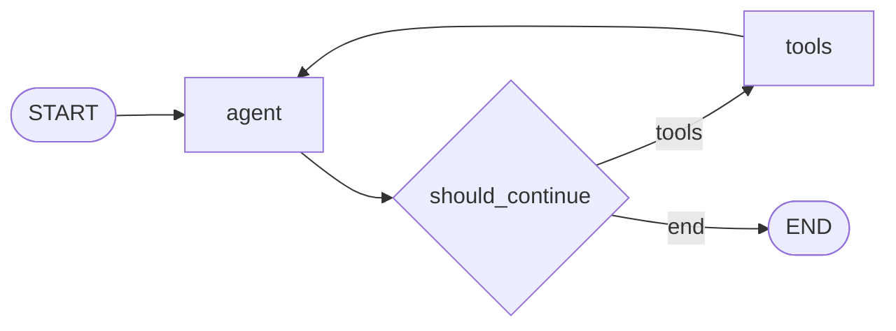
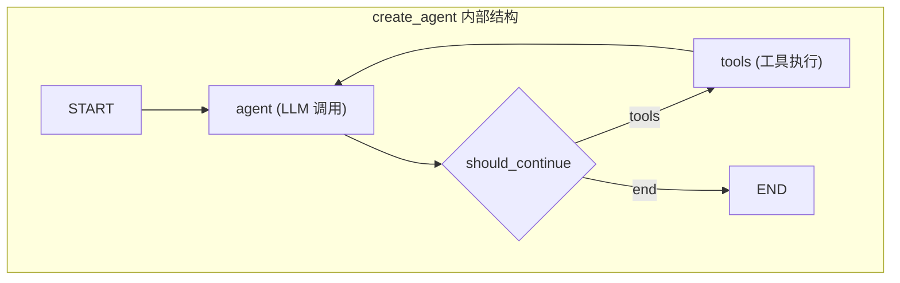

# Day 06 — 高级模式：stream_events / 子图 / 中间件

## 学习目标

Day 03-05 我们从手写 StateGraph 到 create_agent 高层 API，再给 Agent 装上了 Checkpointer 持久化和 interrupt 人机交互。现在单个 Agent 已经能跑、能存、能等人确认，但真实生产还有三个硬需求没解决：**前端要逐 token 打字机效果**（不能等整张图跑完才给用户看）、**多 Agent 系统要把专家 Agent 当"零件"嵌入主流程**（复用而非重写）、**生产要兜底重试和 PII 过滤**（不能裸奔上线）。今天讲的 stream_events / 子图 / 中间件，就是 LangGraph 给这三个需求的原生答案。副线用 Claude Code"调试三件套"配合流式分析，把图从"能跑"推向"可观测"。

学完今天你能：

1. 用 `agent.stream_events(version="v3")` 消费逐 token 消息流、节点级状态快照、中断事件，实现前端打字机效果
2. 把 `create_agent` 创建的 Agent 作为子图节点嵌入主图，实现多 Agent 系统中"专家 Agent 即插即用"
3. 在 `create_agent` 中配置 Middleware 插件（模型重试、工具重试、PII 过滤），理解 2026 年新引入的插件体系
4. 用 `agent.get_graph().draw_mermaid_png()` 可视化图结构，结合 Claude Code 定位流式异常

---

## 一、stream_events 事件流（重点）

### 1.1 为什么需要事件流

LangGraph 的图引擎在执行过程中会产生各种粒度的"事件"——LLM 的逐 token 输出、每个节点执行后的状态快照、interrupt 中断信息。过去 LangGraph 用 `stream_mode="messages"` / `"values"` 等分散 API 来消费这些事件，不同模式之间切换复杂。**`stream_events(version="v3")` 是 LangGraph 在 2026 年推出的统一事件流 API**，用一个入口消费所有粒度的流式数据。

| 场景 | 旧 API | 新 API（推荐） |
|------|--------|----------------|
| 逐 token 打字机 | `astream(stream_mode="messages")` | `stream_events(version="v3").messages` |
| 节点级状态快照 | `astream(stream_mode="values")` | `stream_events(version="v3").values` |
| 中断事件 | 查 `get_state().next` 推断 | `stream_events(version="v3").interrupts` |
| 最终输出 | `invoke` 返回值 | `stream_events(version="v3").output` |

### 1.2 stream_events v3 的 typed projections

`stream_events(version="v3")` 返回一个 `StreamSnapshot` 对象，通过以下 typed projections（类型化属性）访问不同粒度的流数据：

| 属性 | 类型 | 内容 | 粒度 |
|------|------|------|------|
| `.messages` | `list[AIMessageChunk]` | LLM 生成的逐 token 消息 | token 级 |
| `.values` | `dict` | 每个节点执行后的全状态快照 | 节点级 |
| `.interrupts` | `list[InterruptEvent]` | 中断信息列表 | 中断级 |
| `.interrupted` | `bool` | 是否发生了中断 | 中断级 |
| `.output` | `dict` | 图的最终输出 | 图级 |

遍历方式是 for 循环逐帧消费，每帧是一个 `StreamSnapshot`，包含上面的属性：

```python
stream = app.stream_events(input, config, version="v3")
for snapshot in stream:
    # 每一帧 snapshot 包含当前节点的产出
    if snapshot.messages:
        for msg in snapshot.messages:
            print(msg.content, end="", flush=True)   # 逐 token 打字机
    if snapshot.values:
        print("状态更新:", snapshot.values)           # 节点级快照
    if snapshot.interrupted:
        print("发生中断:", snapshot.interrupts)       # 中断事件
```

### 1.3 完整示例：消费所有事件类型

```python
"""stream_events_demo.py — 用 stream_events v3 消费所有事件类型

演示内容：
1. create_agent 创建标准 ReAct Agent
2. 用 stream_events(version="v3") 消费 messages / values / interrupts
3. 在前端风格的循环中分别处理打字机文本、状态更新、中断信息
"""

from langchain.agents import create_agent
from langchain.chat_models import init_chat_model
from langchain_core.tools import tool
from langgraph.checkpoint.memory import InMemorySaver


@tool
def get_weather(city: str) -> str:
    """查询指定城市的当前天气。"""
    # 模拟天气查询
    data = {"北京": "晴 22°C", "成都": "多云 28°C", "上海": "小雨 19°C"}
    return data.get(city, f"{city}：气温 20°C，天气未知")


@tool
def get_temperature(city: str) -> str:
    """查询指定城市的当前温度。"""
    data = {"北京": "22°C", "成都": "28°C", "上海": "19°C"}
    return data.get(city, "20°C")


model = init_chat_model("gpt-4o-mini", temperature=0)

agent = create_agent(
    model=model,
    tools=[get_weather, get_temperature],
    system_prompt="你是天气助手，负责查询天气。",
    checkpointer=InMemorySaver(),
)

config = {"configurable": {"thread_id": "stream-demo-001"}}

input_data = {
    "messages": [{"role": "user", "content": "北京今天天气怎么样？温度多少？"}]
}

stream = agent.stream_events(input_data, config, version="v3")

# — 消费所有事件类型 —
for idx, snapshot in enumerate(stream):
    print(f"\n=== 帧 {idx + 1} ===")

    # 1) messages：逐 token 流式文本
    if snapshot.messages:
        for msg in snapshot.messages:
            if msg.content:
                print(f"[token]: {msg.content}")

    # 2) values：节点级状态快照
    if snapshot.values:
        top_keys = list(snapshot.values.keys())
        print(f"[state]: keys={top_keys}")

    # 3) interrupts：中断信息
    if snapshot.interrupted:
        print(f"[interrupt]: {snapshot.interrupts}")

# 最终输出
final_output = stream.output
if final_output:
    last_msg = final_output["messages"][-1]
    print(f"\n最终回答: {last_msg.content}")
```

### 1.4 stream(version="v2") 与 StreamPart dict

除了 v3，LangGraph 也保留了 `stream(version="v2")` 作为轻量级流式选择。它返回统一的 `StreamPart` 字典流，每个条目包含 `{type, ns, data}` 三个字段：

```python
"""stream_v2_demo.py — stream(version="v2") 返回统一 StreamPart dict"""

# 接续上面的 agent / config / input_data
for event in agent.stream(input_data, config, version="v2"):
    # event 是一个 dict: {"type": str, "ns": list[str], "data": dict}
    if event["type"] == "values":
        print(f"[values] ns={event['ns']}, data keys={list(event['data'].keys())}")
    elif event["type"] == "messages":
        for msg in event["data"].get("messages", []):
            if hasattr(msg, "content") and msg.content:
                print(f"[messages] {msg.content}")
    elif event["type"] == "interrupts":
        print(f"[interrupts] {event['data']}")
```

**v2 与 v3 的选择建议：**

| 维度 | stream(version="v2") | stream_events(version="v3") |
|------|---------------------|----------------------------|
| 返回类型 | 原始 StreamPart dict | 类型化的 StreamSnapshot 对象 |
| 访问方式 | `event["type"]` / `event["data"]` | `snapshot.messages` / `.values` 等属性 |
| 学习成本 | 低，纯 dict 直白 | 略高，需要了解各个 projection |
| 类型安全 | 无（手写 key） | 有（IDE 补全友好） |
| 推荐度 | 快速原型 | 生产代码，可维护性更好 |

### 1.5 在 tool 内用 get_stream_writer 发送自定义事件

当工具函数执行时，有时需要实时发送中间进度（如"正在检索知识库第 3/10 条"）。LangGraph 提供了 `get_stream_writer`，让节点或工具内直接写入自定义流数据：

```python
"""custom_stream_event.py — 在 tool 内用 get_stream_writer 发自定义事件"""

from langgraph.config import get_stream_writer
from langchain_core.tools import tool


@tool
def search_knowledge_base(query: str) -> str:
    """在知识库中搜索，并实时报告搜索进度。"""
    writer = get_stream_writer()             # ← 获取当前流的 writer
    chunks = ["结果A", "结果B", "结果C"]

    for i, chunk in enumerate(chunks):
        # 发送自定义事件，type 为 "custom_progress"
        writer({"type": "custom_progress", "data": {"progress": f"第 {i+1}/{len(chunks)} 条", "content": chunk}})

    return "；".join(chunks)
```

在消费端，如果是 `stream(version="v2")`，自定义事件的 `type` 字段就是你在 writer 里指定的值：

```python
for event in agent.stream(input_data, config, version="v2"):
    if event["type"] == "custom_progress":
        print(f"进度: {event['data']['progress']} → {event['data']['content']}")
```

> **和 Week 02 SSE 的呼应：** Week 02 我们手动把 token 包成 `data: {...}\n\n` 推给前端。今天 LangGraph 的 `stream_events(version="v3")` 通过 `.messages` 属性直接暴露 token 流，你在 FastAPI 路由里包一层 `StreamingResponse` 就能复用 Week 02 的 SSE 通道——底层管道相同，只是 token 来源从手写 httpx 换成了 LangGraph。

---

## 二、子图 Subgraph：Agent 即插即用

### 2.1 什么是子图

当一张图有十几个节点、多个条件分支、并行路径时，全部塞在一个 StateGraph 里既难以维护也无法复用。**子图（Subgraph）的思路是把一段相对独立的子流程编译成一张独立的图，然后作为"一个节点"嵌入主图。**

在 LangGraph 中，**任何编译好的图（`CompiledGraph`）或 `create_agent` 创建的 Agent 都可以直接作为节点加入另一张图**——这就是"子图即节点"的核心思想。

### 2.2 create_agent 作为子图节点

`create_agent` 返回的 Agent 本身是一个 `CompiledGraph`（语言的图），因此可以直接传给主图的 `add_node`：

```python
"""subgraph_create_agent.py — 用 create_agent 创建子 Agent 嵌入主图

演示内容：
1. 创建两个专家 Agent（水果专家 / 蔬菜专家）
2. 主图根据用户输入路由到对应的专家子图
3. 子图 Agent 内置工具循环和 Checkpointer，完全独立运行
"""

from langchain.agents import create_agent
from langchain.chat_models import init_chat_model
from langchain_core.tools import tool
from langgraph.graph import StateGraph, START, END
from langgraph.checkpoint.memory import InMemorySaver
from typing import TypedDict


# ─── 工具定义 ───

@tool
def fruit_catalog(query: str) -> str:
    """查询水果信息。"""
    data = {"苹果": "苹果是蔷薇科水果，富含维生素C", "香蕉": "香蕉富含钾元素，有助于消化"}
    return data.get(query, f"未找到水果: {query}")


@tool
def veggie_catalog(query: str) -> str:
    """查询蔬菜信息。"""
    data = {"菠菜": "菠菜富含铁和叶酸，是深绿色蔬菜", "胡萝卜": "胡萝卜富含β-胡萝卜素，对视力有益"}
    return data.get(query, f"未找到蔬菜: {query}")


# ─── 子 Agent 1：水果专家 ───
model = init_chat_model("gpt-4o-mini", temperature=0)

fruit_expert = create_agent(
    model=model,
    tools=[fruit_catalog],
    system_prompt="你是水果专家，只回答水果相关问题。使用 fruit_catalog 工具查询信息。",
    checkpointer=InMemorySaver(),    # 子图自带检查点
)

# ─── 子 Agent 2：蔬菜专家 ───
veggie_expert = create_agent(
    model=model,
    tools=[veggie_catalog],
    system_prompt="你是蔬菜专家，只回答蔬菜相关问题。使用 veggie_catalog 工具查询信息。",
    checkpointer=InMemorySaver(),
)


# ─── 主图 State ───
class MainState(TypedDict):
    """主图状态。专家子图有自己的内部状态，主图不感知。"""
    input_text: str
    category: str        # 路由结果："fruit" / "veggie"
    final_answer: str


# ─── 主图节点 ───
def classify_node(state: MainState) -> dict:
    """分类节点：判断用户输入是水果还是蔬菜问题。"""
    text = state["input_text"]
    # 简单关键词分类（生产环境应使用 LLM 分类）
    category = "fruit" if any(k in text for k in ["苹果", "香蕉", "水果"]) else "veggie"
    return {"category": category}


def compose_input(state: MainState) -> dict:
    """封装节点：把主图数据转成子图 Agent 需要的消息格式。"""
    # 返回 final_answer 占位，子图的输出通过 add_node 返回的 state 合并
    return {}


def final_node(state: MainState) -> dict:
    """汇总节点：从主图 messages 中提取最终回答。"""
    return {}


# ─── 建主图 ───
main_builder = StateGraph(MainState)

main_builder.add_node("classifier", classify_node)
# 关键：把 create_agent 编译好的子图作为节点加入主图
main_builder.add_node("fruit_expert", fruit_expert)     # ← 子图作为节点
main_builder.add_node("veggie_expert", veggie_expert)   # ← 子图作为节点

main_builder.add_edge(START, "classifier")

# 条件路由：根据分类选择子图
def route_to_expert(state: MainState):
    if state["category"] == "fruit":
        return "fruit_expert"
    return "veggie_expert"

main_builder.add_conditional_edges("classifier", route_to_expert)
main_builder.add_edge("fruit_expert", END)
main_builder.add_edge("veggie_expert", END)

main_app = main_builder.compile(checkpointer=InMemorySaver())

# ─── 调用 ───
config = {"configurable": {"thread_id": "subgraph-demo"}}
result = main_app.invoke(
    {"input_text": "苹果有什么营养价值？"},
    config,
)
# 子图 Agent 内部自动调用了 fruit_catalog 工具并生成回答
print("最终回答:", result.get("final_answer", "(查看 last message)"))
```

### 2.3 子图的检查点策略

| 策略 | 行为 | 适用场景 |
|------|------|----------|
| **per-invocation**（默认） | 每次子图被调用时，子图内部状态独立存档 | 子图每次调用是独立的"任务会话" |
| **per-thread** | 子图和主图共享 thread_id 的存档链 | 子图需要感知主图的历史上下文 |
| **stateless** | 子图不存档，子图内状态不持久化 | 子图是纯计算节点，无状态需求 |

> **关键认知：** 子图的"独立 State"是 LangGraph 架构设计的精髓——主图的 `MainState` 没有水果/蔬菜专家内部的 `messages` 字段，子图的内部状态对外界完全封装。这让不同团队可以各自维护自己的子图 State 定义，彼此不耦合。

### 2.4 子图的 State 隔离与数据传递

子图运行后，它的内部状态（如 `messages`、工具调用结果）不会污染主图 State。主图拿到的是子图的"最终输出"——即子图 State 中与主图 State 同名字段的合并结果。因此，**如果主图需要拿到子图的产出，需要在主图和子图 State 中定义同名字段**（如 `final_answer`），或通过外层的包装节点做字段映射。

---

## 三、中间件系统（2026 新概念）

### 3.1 什么是 Middleware

**Middleware（中间件）是 LangChain 在 2026 年引入的新插件体系**，它在 Agent 循环的特定执行点注入横切关注点（cross-cutting concerns），让错误重试、敏感信息过滤、人机交互确认等逻辑从业务代码中抽离为可插拔的插件。

为什么要用 Middleware？没有中间件时，重试逻辑得手写在每个工具调用前后：

```python
# ❌ 没有中间件：重试逻辑分散在业务代码里
max_retries = 3
for attempt in range(max_retries):
    try:
        result = model.invoke(messages)
        break
    except Exception:
        if attempt == max_retries - 1:
            raise
        time.sleep(1)
```

有了 Middleware，一行配置注入，业务代码零侵入：

```python
# ✅ 有中间件：重试逻辑由框架接管
agent = create_agent(model, tools, middleware=[ModelRetryMiddleware(max_retries=3)])
# 业务代码里完全不需要写重试——中间件自动兜底
```

### 3.2 预置中间件

LangChain 在 `langchain.agents.middleware` 模块中预置了四个中间件：

| 中间件 | 导入路径 | 作用 | 典型参数 |
|--------|----------|------|----------|
| `ModelRetryMiddleware` | `from langchain.agents.middleware import ModelRetryMiddleware` | LLM 调用失败时自动重试 | `max_retries=3`、`retry_delay=1.0` |
| `ToolRetryMiddleware` | `from langchain.agents.middleware import ToolRetryMiddleware` | 工具调用失败时自动重试 | `max_retries=2`、`retryable_exceptions=(TimeoutError,)` |
| `PIIMiddleware` | `from langchain.agents.middleware import PIIMiddleware` | 检测并过滤输入/输出中的敏感个人信息 | `pii_types=["EMAIL", "PHONE"]`、`mode="mask"` |
| `HumanInTheLoopMiddleware` | `from langchain.agents.middleware import HumanInTheLoopMiddleware` | 工具调用前请求人工确认 | `require_confirmation_for=["delete_*", "send_*"]` |

### 3.3 完整示例：带 Middleware 的 Agent

```python
"""middleware_demo.py — create_agent 配置多个 Middleware

演示内容：
1. ModelRetryMiddleware：LLM 调用失败自动重试 3 次
2. ToolRetryMiddleware：工具调用超时自动重试 2 次
3. PIIMiddleware：过滤输出中的邮箱、手机号
4. 观察中间件日志输出
"""

from langchain.agents import create_agent
from langchain.agents.middleware import (
    ModelRetryMiddleware,
    ToolRetryMiddleware,
    PIIMiddleware,
)
from langchain.chat_models import init_chat_model
from langchain_core.tools import tool
from langgraph.checkpoint.memory import InMemorySaver


@tool
def get_user_info(user_id: str) -> str:
    """查询用户信息，可能返回敏感数据。"""
    data = {
        "u001": "用户张三，邮箱: zhangsan@example.com，电话: 13800138000",
        "u002": "用户李四，邮箱: lisi@example.com，电话: 13900139000",
    }
    return data.get(user_id, "未找到用户")


@tool
def unstable_api(query: str) -> str:
    """模拟一个不稳定会超时的 API。"""
    import random
    if random.random() < 0.3:
        raise TimeoutError("API 超时（模拟）")
    return f"查询结果: {query}"


model = init_chat_model("gpt-4o-mini", temperature=0)

agent = create_agent(
    model=model,
    tools=[get_user_info, unstable_api],
    system_prompt="你是用户信息助手。查询用户信息并返回。",
    checkpointer=InMemorySaver(),
    middleware=[
        ModelRetryMiddleware(max_retries=3, retry_delay=0.5),
        ToolRetryMiddleware(max_retries=2, retryable_exceptions=(TimeoutError,)),
        PIIMiddleware(pii_types=["EMAIL", "PHONE"], mode="mask"),
    ],
)

config = {"configurable": {"thread_id": "middleware-demo"}}
result = agent.invoke(
    {"messages": [{"role": "user", "content": "查询用户 u001 的信息"}]},
    config,
)
print(result["messages"][-1].content)
# 预期输出中邮箱和电话被 mask 掉：
# "用户张三，邮箱: [FILTERED]，电话: [FILTERED]"
```

### 3.4 Middleware 的执行顺序

多个 Middleware 按列表顺序形成"洋葱模型"——外层中间件先拦截请求、后处理响应：

```
请求进入 →
  PIIMiddleware（先过滤输入中的 PII）
    → ToolRetryMiddleware（为工具调用兜底重试）
      → ModelRetryMiddleware（为 LLM 调用兜底重试）
        → Agent 核心循环
      ← ModelRetryMiddleware（处理 LLM 响应异常）
    ← ToolRetryMiddleware（处理工具响应异常）
  ← PIIMiddleware（过滤输出中的 PII）
→ 响应返回
```

### 3.5 Middleware 与 Day 05 interrupt 的对比

| 维度 | StateGraph + interrupt() | HumanInTheLoopMiddleware |
|------|------------------------|--------------------------|
| 层面 | LangGraph 图层面 | Agent 循环层面 |
| 粒度 | 节点级别 | 工具调用级别 |
| 用法 | 手写 `interrupt()` 调用 | 声明式配置 `require_confirmation_for` |
| 灵活性 | 可在图任意位置暂停 | 局限于工具调用前 |
| 开箱即用 | 否，需手写暂停恢复逻辑 | 是，配置即用 |

> **选择建议：** 标准 ReAct Agent 需要简单重试和 PII 过滤 → 用 Middleware 一行配置。需要精细控制图结构、自定义暂停位置 → 用 StateGraph + interrupt()。

---

## 四、图可视化：draw_mermaid_png

### 4.1 可视化图和 Agent

LangGraph 内置了把图结构导出为 Mermaid 格式的能力。对 `create_agent` 创建的 Agent 同样适用——你能看到 Agent 内部的 `agent` 节点与 `tools` 节点之间的循环结构：

```python
"""graph_viz_demo.py — 可视化 Agent 图结构"""

from langchain.agents import create_agent
from langchain.chat_models import init_chat_model
from langchain_core.tools import tool


@tool
def get_weather(city: str) -> str:
    """查询天气。"""
    return f"{city}：晴"


model = init_chat_model("gpt-4o-mini", temperature=0)

agent = create_agent(
    model=model,
    tools=[get_weather],
    system_prompt="你是天气助手。",
)

# 方法 1：导出 Mermaid 文本
mermaid_text = agent.get_graph().draw_mermaid()
print(mermaid_text)

# 方法 2：导出 PNG 图片（需要安装 pygraphviz）
# agent.get_graph().draw_mermaid_png(output_path="agent_graph.png")
```

导出的 Mermaid 文本直接复制到支持 Mermaid 渲染的编辑器即可看到图结构：



### 4.2 create_agent 内部结构的可视化

`create_agent` 创建的 Agent 底层是一张标准的 ReAct 循环图，包含三个关键部分：

| 图元素 | 角色 | 说明 |
|--------|------|------|
| `agent` 节点 | LLM 调用 | 把当前 messages 发给模型，拿到回复或 tool_calls |
| `tools` 节点 | 工具执行 | 执行 LLM 请求的工具调用并返回结果 |
| `should_continue` 边 | 条件路由 | 检查 LLM 回复是否含 tool_calls，决定继续还是结束 |



### 4.3 子图可视化

当子图嵌入主图时，`draw_mermaid()` 会展示主图的节点。子图节点在图中显示为一个普通节点，但你可以分别对主图和子图调用 `draw_mermaid()` 查看各自的结构：

```python
# 主图结构
print(main_app.get_graph().draw_mermaid())
# → 主图节点: classifier → fruit_expert / veggie_expert → END

# 子图结构
print(fruit_expert.get_graph().draw_mermaid())
# → 子图内部: agent → tools 循环
```

---

## 五、副线：Claude Code 调试流式与状态机

### 5.1 调试三件套

当 Agent 流式输出异常、状态卡住或行为不对时，LangGraph 提供了三个工具配合 Claude Code 定位问题：

| 工具 | 看什么 | 适合 |
|------|--------|------|
| `agent.get_state(config)` | 当前状态快照 + `next` 节点 | 卡住时定位现场 |
| `agent.get_graph().draw_mermaid()` | 图拓扑结构 | 确认节点连接是否正确 |
| `stream_events` | 流式输出每一步的 messages / values | 分析逐 token 输出异常 |

### 5.2 实战：定位流式输出缺失

场景：Agent 在 stream_events 中突然停止输出 token，但图没有报错。

```python
# 第一步：用 get_state 确认图的状态
snapshot = agent.get_state(config)
print("next:", snapshot.next)           # 停在哪个节点
print("values keys:", list(snapshot.values.keys()))

# 第二步：把 Mermaid 图和 get_state 输出给 Claude Code
# 你复制给 Claude Code：
"""
我的 create_agent 在 stream_events 中只输出了前 3 个 token 就停了。
get_state 输出：
  next: ('agent',)
  values: {"messages": [...], "interrupt": [...]}

Mermaid 图：
graph LR
    START --> agent
    agent --> should_continue
    should_continue -- tools --> tools
    should_continue -- end --> END
    tools --> agent

流式返回后 next 指向 agent，但 agent 节点没有继续输出 token。
可能是什么原因？
"""
```

### 5.3 三路交叉比对法

Claude Code 调试的核心思路是"三路交叉比对"：

1. **Mermaid 图** → 看结构对不对（节点是否连好、边是否通到 END）
2. **get_state** → 看运行时状态对不对（next 应该指向哪个节点、values 字段是否完整）
3. **stream_events 输出** → 看执行过程对不对（messages 流是否完整、有无中断事件）

三条信息合在一起，Claude Code 能快速定位"结构正确但运行时异常"的微妙 bug——这类 bug 人脑靠硬读数小时，AI 几秒就能交叉分析出根因。

### 5.4 调试工作流

把副线总结成一个可复用的调试流程：

```
Agent 流式异常 / 卡住 / 输出不对
        │
        ▼
① agent.get_graph().draw_mermaid()   → 贴给 Claude Code
        │
        ▼
② agent.get_state(config)            → 贴给 Claude Code
        │
        ▼
③ stream_events 的输出片段           → 贴给 Claude Code
        │
        ▼
④ 让 Claude Code 做三路交叉分析：
   "Mermaid 图显示节点 A → B，但 get_state 的 next 是 A，
    stream_events 中 A 节点没有输出 token。哪里不对？"
        │
        ▼
⑤ 按建议修复 → 重新跑 → 把新输出贴回去验证
```

> **和 Day 03 的 ASCII 草图对比：** Day 03 让 Claude Code 画 ASCII 草图来"先想清楚再写代码"。今天让它基于 `draw_mermaid()` 精确图和 `get_state` 运行时数据做诊断——从"设计辅助"进化到"调试诊断"。这是副线从 Week 03 走到 Week 06 的能力跃迁。

---

## 六、动手实验

### 🟢 青铜级：跑通 stream_events 消费所有事件类型

把第一节的 `stream_events_demo.py` 完整跑通，分别观察 `.messages`（逐 token）、`.values`（状态快照）、`.interrupts`（中断）的输出。然后用 `stream(version="v2")` 再跑一遍，对比两种 API 的差异。

### 🟡 白银级：create_agent 做子图嵌入主图

跑通第二节的 `subgraph_create_agent.py`，让主图根据用户输入路由到水果/蔬菜专家 Agent。然后用 `main_app.get_graph().draw_mermaid()` 打印主图 Mermaid 图，再用 `fruit_expert.get_graph().draw_mermaid()` 打印子图内部结构，观察两张图的层级关系。

### 🔴 王者级：三合一高级 Agent

把今天三大件揉到一起：**stream_events（流式）+ 子图（专家 Agent）+ Middleware（中间件）**。创建一个 `advanced_agent.py`，满足：

1. 主图包含两个专家子图（水果专家 / 蔬菜专家），用条件分支路由
2. 主图的 `create_agent` 配置了 `ModelRetryMiddleware` 和 `PIIMiddleware`
3. 调用时用 `stream_events(version="v3")` 消费所有事件类型
4. 用 `draw_mermaid_png()` 保存可视化图
5. 把流式输出和 Mermaid 图贴给 Claude Code，让它确认拓扑是否正确

这就是今天产出文件 `advanced_agent.py` 的目标形态。

---

## 七、踩坑记录 🕳️

### 坑 1：stream_events v3 遍历时跳过了某些帧

**症状：** for 循环遍历 stream 时，感觉少了一些节点的事件帧。

**原因：** `stream_events(version="v3")` 默认不会在每个节点后都产生帧——如果节点未更新任何状态或 LLM 无输出，对应帧可能为空。

**解决：** 在 for 循环里不要假设每一帧都有 messages 或 values，用 `if snapshot.messages:` / `if snapshot.values:` 做防御检查。如果需要"每个节点都有 event"，考虑用 `stream(version="v2")` + `event["type"]` 过滤。

### 坑 2：子图 Agent 的 State 和主图 State 字段冲突

**症状：** 主图定义的 `final_answer` 字段被子图的内部状态覆盖了，或者子图返回的字段没传回主图。

**原因：** 子图的 State 定义和主图 State 定义中如果有同名字段但类型不同，LangGraph 的合并不一定按预期工作。特别是 `messages` 这样的 `add_messages` 字段，子图和主图各有各的 reducer。

**解决：** 主图和子图 State 尽量不要定义同名字段。主图通过"包装节点"显式从子图的最终 State 中提取所需数据。如果必须共享字段，确保两者类型和 reducer 一致。

### 坑 3：Middleware 配置后 Agent 行为不变

**症状：** `create_agent(..., middleware=[...])` 加了中间件，但异常仍然没被兜底，PII 仍然没被过滤。

**原因：** 最常见的原因是中间件导入路径不正确。2026 年的官方导入路径是 `from langchain.agents.middleware import ...`，而非旧版的 `from langchain.middleware`。另一个可能是 `create_agent` 版本不支持 middleware 参数（需要 LangChain >= 2026.04）。

**解决：** 检查 LangChain 版本并确认导入路径。在配置中加入调试日志：`middleware=[ModelRetryMiddleware(max_retries=3, log_retries=True)]`，观察中间件日志确认是否被触发。

### 坑 4：draw_mermaid_png 导出报错或生成空图

**症状：** `agent.get_graph().draw_mermaid_png("output.png")` 报错，或者生成的 PNG 是空白/不完整。

**原因：** `draw_mermaid_png()` 需要可选依赖 `pygraphviz` 或 `graphviz`，如果未安装会报 `ImportError`。另外如果图还没 `compile()` 就渲染，也可能出现结构不完整。

**解决：** 先安装依赖：`pip install pygraphviz`。先用 `agent.get_graph().draw_mermaid()` 导出文本版本，在 Mermaid Live Editor 里验证结构正确，再用 `draw_mermaid_png()` 导出图片。如果只是 Mermaid 文本就能满足需求，无需强求 PNG 导出。

### 坑 5：get_stream_writer 在非流式上下文中报错

**症状：** 工具函数里用了 `get_stream_writer()`，但在 `invoke`（非流式）调用时报错。

**原因：** `get_stream_writer()` 只在 `stream` / `stream_events` 的上下文中可用。在 `invoke` 模式下没有活跃的流 writer。

**解决：** 用 `try-except` 包裹，让工具在非流式模式下优雅降级：

```python
from langgraph.config import get_stream_writer

@tool
def my_tool(query: str) -> str:
    try:
        writer = get_stream_writer()
        writer({"type": "progress", "data": {"msg": "处理中..."}})
    except Exception:
        pass   # 非流式模式下静默跳过
    return "结果"
```

---

## 八、副线笔记：Claude Code 调试心得

### 8.1 流式异常最常见的三种表现

本周副线在调试流式和状态机时，遇到了三种典型异常模式：

| 模式 | 症状 | Claude Code 推荐检查方向 |
|------|------|------------------------|
| **流中断** | 输出了几个 token 后突然停止，无报错 | 检查 LLM 节点是否在非流式模式下产生了 `AIMessage`（整块返回）而非 `AIMessageChunk`（逐 token） |
| **状态回滚** | 某一步之后 values 回到更早的状态 | 检查 reducer 是否正确（是否缺少 `operator.add` 导致覆盖而非追加） |
| **子图未执行** | stream 中跳过了子图节点的事件 | 检查条件边的返回值是否和 `add_node` 注册的名字完全一致 |

### 8.2 三件套配合 Claude Code 的黄金流程

```
Agent 行为异常
    │
    ├─①─ agent.get_graph().draw_mermaid() → 贴给 Claude Code
    │    （确认结构正确）
    │
    ├─②─ agent.get_state(config) → 贴给 Claude Code
    │    （确认运行时状态）
    │
    ├─③─ 把 stream_events 输出片断贴给 Claude Code
    │    （确认执行路径）
    │
    └─④─ Claude Code 三路交叉分析 → 给出诊断 + 修复建议
```

### 8.3 核心心得：可观测性是 Agent 工程化的命脉

Week 03 手写 Agent 时，调试靠 `print` 和 `pdb`，状态散在变量里。到了 Week 06，状态被收进 State、控制流变成图、执行有 `stream_events` 可观测——**可观测性的基础设施终于齐了**。

- `get_state` → 看运行时状态
- `draw_mermaid()` → 看图结构
- `stream_events` → 看执行过程
- 把这些喂给 Claude Code → 做综合诊断

四件套凑齐，Agent 才从"能跑的脚本"变成"可运维的系统"。

> **一句话：** Agent 工程化的命脉不是"让它更聪明"，而是"让它可观测"。不可观测的 Agent 上不了生产——你不知道它什么时候会抽风，抽风了你也不知道为什么。今天的 stream_events / draw_mermaid / get_state 就是把这个命脉握在手里。

---

## 今日产出检查清单

- [ ] 理解 `stream_events(version="v3")` 的 typed projections（messages / values / interrupts / output），跑通完整消费循环
- [ ] 区分 `stream(version="v2")` 和 `stream_events(version="v3")`，能按场景选择
- [ ] 理解子图的"独立 State"与"即插即用"特性，用 `create_agent` 创建子 Agent 嵌入主图
- [ ] 在 `create_agent` 中配置 `ModelRetryMiddleware`、`ToolRetryMiddleware`、`PIIMiddleware`，理解中间件执行顺序
- [ ] 用 `agent.get_graph().draw_mermaid()` 导出图结构文本，理解 Agent 内部 agent⇄tools 循环
- [ ] 产出 `advanced_agent.py`（子图 + stream_events + Middleware 三合一）并附调试日志

---

> **下一课预告：Day 07 — 综合实战：多步推理 Agent**。把本周的 LangChain 组件（`create_agent` / `@tool`）、LangGraph 图编排（StateGraph）、持久化（Checkpointer / interrupt）、高级模式（stream_events / 子图 / Middleware）全部用上，搭一个"路线推荐 → 天气查询 → 装备清单 → 出行建议"的多步推理 Agent，FastAPI 服务化 + Web UI，全程 Claude Code 结对编程。今天的高级模式会在 Day 07 真正落地——stream_events 把建议逐 token 推给前端、子图封装装备推荐子流程、Middleware 兜底异常重试。本周收官战。